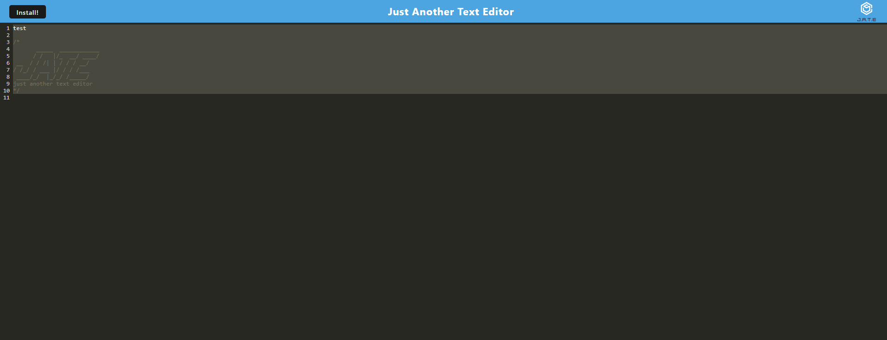

# JATE- Just Another Text Editor

## Landing Page

JATE is as it sounds. Just Another Text Editor. JATE allows the user to modify and write code which a service worker catches and puts in the indexDB. To install JATE simply use the command `npm i` then `npm start` alternatively you can go to the [Live Version](https://jate111.herokuapp.com/) on heroku!

## Screenshot
A screenshot of JATE

## Questions

You can reach the creator of this project at:
[Github](http://github.com/Travis-Anderson023)
[email](mailto:tsanderson.023@gmail.com)